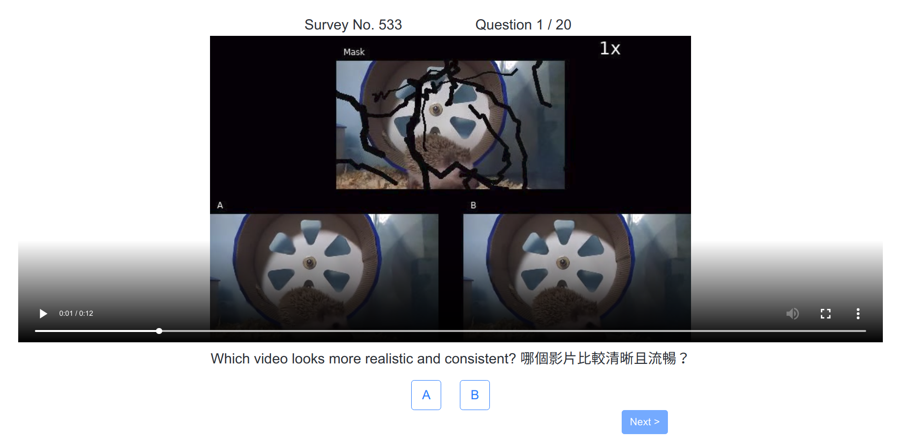

# User Study Website for Computer Vision

Flask+React website for user study.

<kbd>  </kbd>

## Demo
See the [demo client](https://cv-user-study-website-demo.netlify.com/) and [demo server](https://cv-user-study-website.herokuapp.com/) (+endpoint: `/show_results`, `/show_answers`, `/show_video_pairs`, `/show_usernames`)

## Introduction
It was originally used to setup surveys that ask user's preferance for video pairs.

After the user enters his/her name, n video pairs will be selected from the database according to their answered times.

The website will then show these video pairs to the user and asks their preferance one by one.

A video pair should consist of two sub-videos by different methods to compare (i.e. ours vs baseline).

The video data and URL are defined in a csv (`tests/example.csv`) and will be read before the server starts.

## How to run

### Back-end
1. Install miniconda/anaconda, a package for package/environment management
```
wget repo.continuum.io/miniconda/Miniconda3-latest-Linux-x86_64.sh
bash Miniconda3-latest-Linux-x86_64.sh
```

2. Build conda environment from file
```
conda env create -f environment.yaml
```

3. Activate the environment
```
source activate user_study
```

4. Edit `src/config.py` for the database settings (skip this step to use example database for testing)

5. Run 
```
cd src

# export FLASK_RUN_PORT=5000
# export FLASK_RUN_HOST=0.0.0.0
export FLASK_APP=app.py
flask run
```

### Front-end
1. Install nodejs and npm

2. Run
```
cd client
npm install
export REACT_APP_ENDPOINT=<the path to your server; for example, http://localhost:5000>
# export PORT=3000
npm start
```

## How to deploy
### If you have a server
Simply running the afrorementioned steps with proper ports should work.

### If you do not have a server
#### Deploy the back-end
1. Go to [Heroku](https://www.heroku.com/) and create an app
2. Connect to this repo (fork it first)
3. Manually deploy the master branch

#### Deploy the front-end
1. Go to [Netlify](https://www.netlify.com/) and create an website
2. Set `Build command` to `cd client && npm i && npm run build` and `Publish directory` to `client/build`
3. Add an environment variables: `REACT_APP_ENDPOINT` to your back-end server address


## Repository Structure
```
├── .flake8                 Syntax and style settings for Flake8
├── .gitignore              Filenames in this file would be ignored by Git
├── .travis.yml             For Travis CI configuration
├── environment.yaml        For Conda environment
├── README.md
├── LICENSE                 LICENSE file (MIT license here)
├── .github/                For the PR template
├── tests/                  For tests
├── lib/                    For third-party libraries
├── client/                 For React client source code
└── src/                    For Flask server source code
    ├── app.py              Main Flask app
    ├── config.py           All configs
    ├── db_interface.py     Functions for database I/O
    ├── __init__.py         App initialization
    ├── logging_config.py   Logger config
    └── model.py            ORM models

```

## TODO
Contributions are welcome!

- [ ] Refactoring: the model and db_interface are now fixed and they may be hard to modify
- [ ] Database migration
- [ ] UI improvement
- [ ] Error handling

## License

MIT 

## Authors

Ya-Liang Chang (Allen) [amjltc295](https://github.com/amjltc295/)


